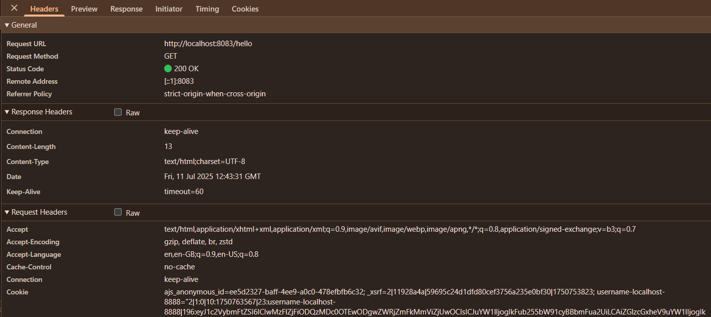
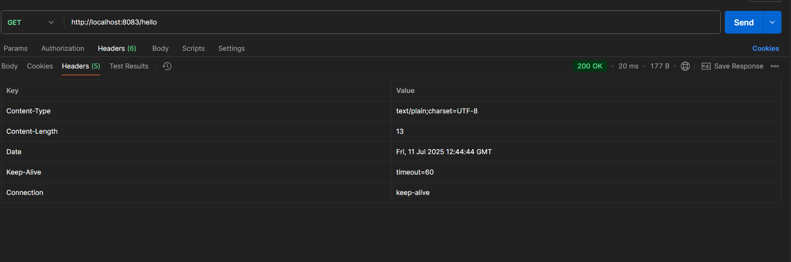
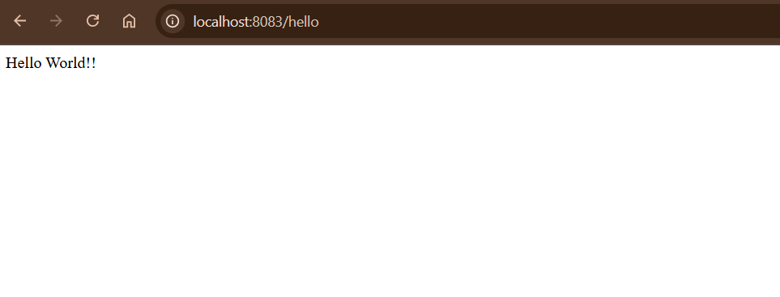
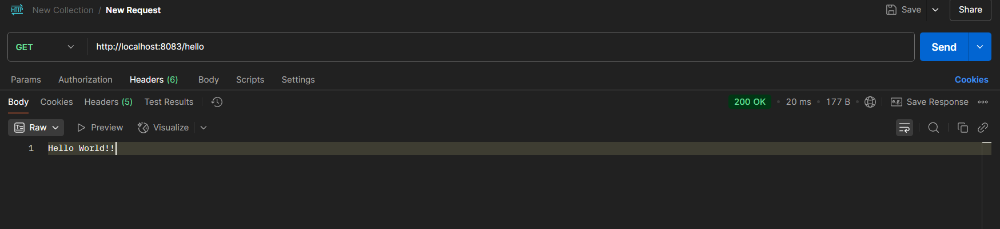

# Hello World RESTful Web Service
---
## 1. In network tab of developer tools show the HTTP header details received

---

## 2. In postman click on "Headers" tab to view the HTTP header details received

---

##  Application Output

**Browser**
---

**Postman**
---

