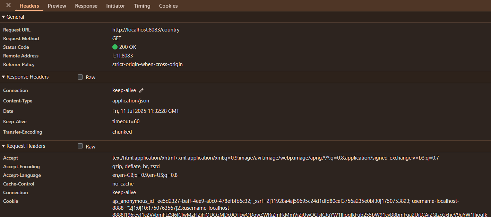
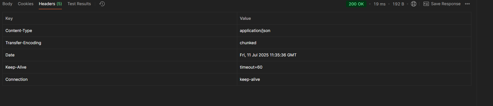
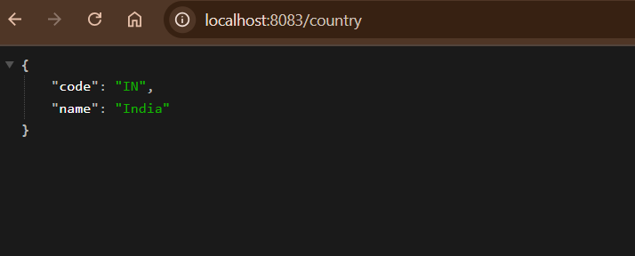
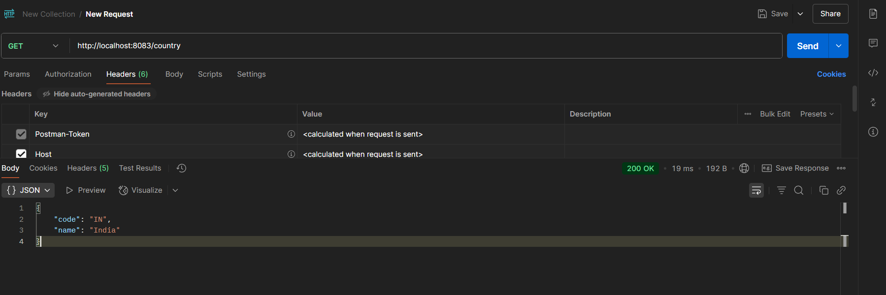

# REST - Country Web Service
---

## 1. What happens in the controller method?
```java
package com.cognizant.springlearn.controller;

import com.cognizant.springlearn.Country;
import org.slf4j.Logger;
import org.slf4j.LoggerFactory;
import org.springframework.context.ApplicationContext;
import org.springframework.context.support.ClassPathXmlApplicationContext;
import org.springframework.web.bind.annotation.RequestMapping;
import org.springframework.web.bind.annotation.RestController;

@RestController
public class CountryController {

    private static final Logger LOGGER = LoggerFactory.getLogger(CountryController.class);

    @RequestMapping("/country")
    public Country getCountryIndia() {
        LOGGER.debug("Start getCountryIndia()");
        ApplicationContext context = new ClassPathXmlApplicationContext("country.xml");
        Country country = (Country) context.getBean("country", Country.class);
        LOGGER.debug("End getCountryIndia()");
        return country;
    }
}
Country country = context.getBean("country", Country.class);
```
The following steps take place:

- Spring Boot receives a GET request at `/country`.
- It calls the `getCountryIndia()` method in your controller.
- Inside this method:
   - It loads the Spring XML configuration file `country.xml`.
   - It fetches the bean with ID `country` (with values `code = "IN", name = "India"`).
   - The method returns the `Country` object, which will be automatically serialized to JSON.

---

## 2. How the bean is converted into JSON response?
The returned `Country` Java object is automatically converted to JSON by **Spring Boot** using the **Jackson library**, which is included by default.
- Spring checks if the method return type is an object (POJO).
- It applies the `@RestController` or `@ResponseBody` annotation.
- Jackson converts the object into JSON format.
- The HTTP response includes `Content-Type: application/json`.

Example **JSON response** returned:
```json
{
  "code": "IN",
  "name": "India"
}
```
---

## 3. In Network tab of Developer Tools, show the HTTP header details received


---

## 4. In postman click on "Headers" tab to view the HTTP header details received



---

##  Application Output

**Browser**
---


**Postman**
---

