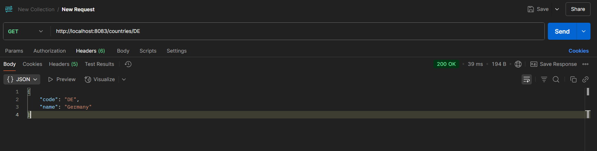

# REST - Get country based on country code 
---

## Aplication Output:

Below are the screenshots of JSON responses for each country code ( `IN`, `US`, `DE`, `JP` ) retrieved via the `/countries/{code}` endpoint.

---

---

---

