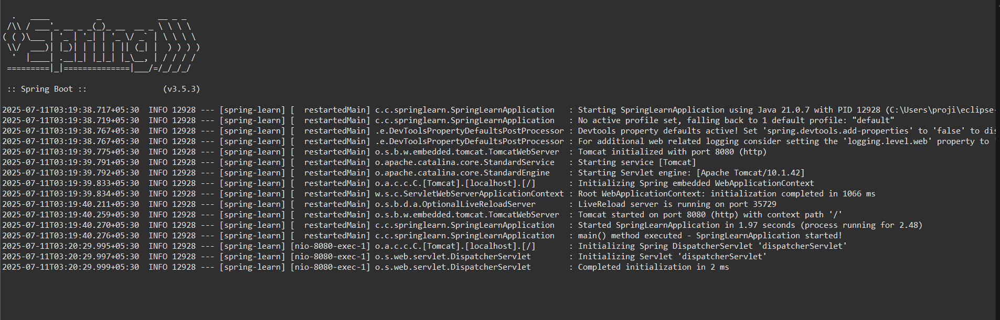

# Week 4 – Spring Boot Web Project

This project demonstrates how to build a simple Spring Boot web application using Maven.

---

##  Project Structure

```
spring-learn/
├── .gitattributes
├── HELP.md
├── mvnw
├── mvnw.cmd
├── pom.xml
├── README.md
├── .mvn/
│   └── wrapper/
│       └── maven-wrapper.properties
├── src/
│   ├── main/
│   │   ├── java/
│   │   │   └── com/cognizant/springlearn/
│   │   │       └── SpringLearnApplication.java
│   │   └── resources/
│   │       ├── application.properties
│   │       ├── static/
│   │       └── templates/
│   └── test/
│       └── java/
│           └── com/cognizant/springlearn/
│               └── SpringLearnApplicationTests.java
```

---

##  SpringLearnApplication.java - Main Method

This is the main entry point of the Spring Boot application:

```java
package com.cognizant.springlearn;

import org.slf4j.Logger;
import org.slf4j.LoggerFactory;
import org.springframework.boot.SpringApplication;
import org.springframework.boot.autoconfigure.SpringBootApplication;

@SpringBootApplication
public class SpringLearnApplication {

    private static final Logger LOGGER = LoggerFactory.getLogger(SpringLearnApplication.class);

    public static void main(String[] args) {
        SpringApplication.run(SpringLearnApplication.class, args);
        LOGGER.info("main() method executed - SpringLearnApplication started!");
    }
}
```

- `SpringApplication.run(...)` launches the application.
- The custom `System.out.println()` helps confirm execution.

---

##  Purpose of `@SpringBootApplication`

The `@SpringBootApplication` annotation is a convenience annotation that combines:
- `@Configuration` – Marks the class as a source of bean definitions.
- `@EnableAutoConfiguration` – Enables Spring Boot’s auto-configuration.
- `@ComponentScan` – Scans for Spring components (e.g., controllers, services).

This annotation simplifies configuration and bootstrapping.

---

##  `pom.xml` Configuration

The `pom.xml` defines project metadata, dependencies, and build configuration.

### Key Elements:
```xml
<?xml version="1.0" encoding="UTF-8"?>
<!-- Root element of the Maven POM file -->
<project xmlns="http://maven.apache.org/POM/4.0.0"
         xmlns:xsi="http://www.w3.org/2001/XMLSchema-instance"
         xsi:schemaLocation="http://maven.apache.org/POM/4.0.0 https://maven.apache.org/xsd/maven-4.0.0.xsd">
    
    <!-- POM model version -->
    <modelVersion>4.0.0</modelVersion>

    <!-- Inherit defaults and dependency management from Spring Boot's parent POM -->
    <parent>
        <groupId>org.springframework.boot</groupId>
        <artifactId>spring-boot-starter-parent</artifactId>
        <version>3.5.3</version>
        <relativePath/> <!-- Looks up the parent from the central repository -->
    </parent>

    <!-- Project's unique identifier -->
    <groupId>com.cognizant</groupId>           <!-- Company or organization name -->
    <artifactId>spring-learn</artifactId>      <!-- Name of the project -->
    <version>0.0.1-SNAPSHOT</version>          <!-- Current development version -->

    <!-- Optional metadata -->
    <name>spring-learn</name>
    <description>Spring Boot Web Project</description>
    <url/> <!-- Project website URL (empty for now) -->

    <!-- Licensing info (empty now) -->
    <licenses>
        <license/>
    </licenses>

    <!-- Developer info (not filled) -->
    <developers>
        <developer/>
    </developers>

    <!-- Source code management info (not filled) -->
    <scm>
        <connection/>
        <developerConnection/>
        <tag/>
        <url/>
    </scm>

    <!-- Java version used for compilation -->
    <properties>
        <java.version>17</java.version> <!-- Ensure Java 17 is used -->
    </properties>

    <!-- Dependencies needed for the project -->
    <dependencies>
        <!-- Core Spring Boot Web dependency (includes Tomcat, REST, etc.) -->
        <dependency>
            <groupId>org.springframework.boot</groupId>
            <artifactId>spring-boot-starter-web</artifactId>
        </dependency>

        <!-- DevTools for live reload and development convenience -->
        <dependency>
            <groupId>org.springframework.boot</groupId>
            <artifactId>spring-boot-devtools</artifactId>
            <scope>runtime</scope>
            <optional>true</optional> <!-- Not required in production -->
        </dependency>

        <!-- Spring Boot Testing dependency (JUnit, Mockito, etc.) -->
        <dependency>
            <groupId>org.springframework.boot</groupId>
            <artifactId>spring-boot-starter-test</artifactId>
            <scope>test</scope>
        </dependency>
    </dependencies>

    <!-- Build configuration for Maven -->
    <build>
        <plugins>
            <!-- Spring Boot plugin to package the app as an executable JAR -->
            <plugin>
                <groupId>org.springframework.boot</groupId>
                <artifactId>spring-boot-maven-plugin</artifactId>
            </plugin>
        </plugins>
    </build>

</project>

```

---

##  Dependency Hierarchy


```
com.cognizant:spring-learn:jar:0.0.1-SNAPSHOT
+- org.springframework.boot:spring-boot-starter-web:jar:3.5.3:compile
|  +- org.springframework.boot:spring-boot-starter:jar:3.5.3:compile
|  |  +- org.springframework.boot:spring-boot-starter-logging:jar:3.5.3:compile
|  |  |  +- ch.qos.logback:logback-classic:jar:1.5.18:compile
|  |  |  |  \- ch.qos.logback:logback-core:jar:1.5.18:compile
|  |  |  +- org.apache.logging.log4j:log4j-to-slf4j:jar:2.24.3:compile
|  |  |  |  \- org.apache.logging.log4j:log4j-api:jar:2.24.3:compile
|  |  |  \- org.slf4j:jul-to-slf4j:jar:2.0.17:compile
|  |  +- jakarta.annotation:jakarta.annotation-api:jar:2.1.1:compile
|  |  \- org.yaml:snakeyaml:jar:2.4:compile
|  +- org.springframework.boot:spring-boot-starter-json:jar:3.5.3:compile
|  |  +- com.fasterxml.jackson.core:jackson-databind:jar:2.19.1:compile
|  |  |  +- com.fasterxml.jackson.core:jackson-annotations:jar:2.19.1:compile
|  |  |  \- com.fasterxml.jackson.core:jackson-core:jar:2.19.1:compile
|  |  +- com.fasterxml.jackson.datatype:jackson-datatype-jdk8:jar:2.19.1:compile
|  |  +- com.fasterxml.jackson.datatype:jackson-datatype-jsr310:jar:2.19.1:compile
|  |  \- com.fasterxml.jackson.module:jackson-module-parameter-names:jar:2.19.1:compile
|  +- org.springframework.boot:spring-boot-starter-tomcat:jar:3.5.3:compile
|  |  +- org.apache.tomcat.embed:tomcat-embed-core:jar:10.1.42:compile
|  |  +- org.apache.tomcat.embed:tomcat-embed-el:jar:10.1.42:compile
|  |  \- org.apache.tomcat.embed:tomcat-embed-websocket:jar:10.1.42:compile
|  +- org.springframework:spring-web:jar:6.2.8:compile
|  |  +- org.springframework:spring-beans:jar:6.2.8:compile
|  |  \- io.micrometer:micrometer-observation:jar:1.15.1:compile
|  |     \- io.micrometer:micrometer-commons:jar:1.15.1:compile
|  \- org.springframework:spring-webmvc:jar:6.2.8:compile
|     +- org.springframework:spring-aop:jar:6.2.8:compile
|     +- org.springframework:spring-context:jar:6.2.8:compile
|     \- org.springframework:spring-expression:jar:6.2.8:compile
+- org.springframework.boot:spring-boot-devtools:jar:3.5.3:runtime (optional)
|  +- org.springframework.boot:spring-boot:jar:3.5.3:compile
|  \- org.springframework.boot:spring-boot-autoconfigure:jar:3.5.3:compile
\- org.springframework.boot:spring-boot-starter-test:jar:3.5.3:test
   +- org.springframework.boot:spring-boot-test:jar:3.5.3:test
   +- org.springframework.boot:spring-boot-test-autoconfigure:jar:3.5.3:test
   +- com.jayway.jsonpath:json-path:jar:2.9.0:test
   |  \- org.slf4j:slf4j-api:jar:2.0.17:compile
   +- jakarta.xml.bind:jakarta.xml.bind-api:jar:4.0.2:test
   |  \- jakarta.activation:jakarta.activation-api:jar:2.1.3:test
   +- net.minidev:json-smart:jar:2.5.2:test
   |  \- net.minidev:accessors-smart:jar:2.5.2:test
   |     \- org.ow2.asm:asm:jar:9.7.1:test
   +- org.assertj:assertj-core:jar:3.27.3:test
   |  \- net.bytebuddy:byte-buddy:jar:1.17.6:test
   +- org.awaitility:awaitility:jar:4.2.2:test
   +- org.hamcrest:hamcrest:jar:3.0:test
   +- org.junit.jupiter:junit-jupiter:jar:5.12.2:test
   |  +- org.junit.jupiter:junit-jupiter-api:jar:5.12.2:test
   |  |  +- org.opentest4j:opentest4j:jar:1.3.0:test
   |  |  +- org.junit.platform:junit-platform-commons:jar:1.12.2:test
   |  |  \- org.apiguardian:apiguardian-api:jar:1.1.2:test
   |  +- org.junit.jupiter:junit-jupiter-params:jar:5.12.2:test
   |  \- org.junit.jupiter:junit-jupiter-engine:jar:5.12.2:test
   |     \- org.junit.platform:junit-platform-engine:jar:1.12.2:test
   +- org.mockito:mockito-core:jar:5.17.0:test
   |  +- net.bytebuddy:byte-buddy-agent:jar:1.17.6:test
   |  \- org.objenesis:objenesis:jar:3.3:test
   +- org.mockito:mockito-junit-jupiter:jar:5.17.0:test
   +- org.skyscreamer:jsonassert:jar:1.5.3:test
   |  \- com.vaadin.external.google:android-json:jar:0.0.20131108.vaadin1:test
   +- org.springframework:spring-core:jar:6.2.8:compile
   |  \- org.springframework:spring-jcl:jar:6.2.8:compile
   +- org.springframework:spring-test:jar:6.2.8:test
   \- org.xmlunit:xmlunit-core:jar:2.10.2:test

```

---

##  Application Output



