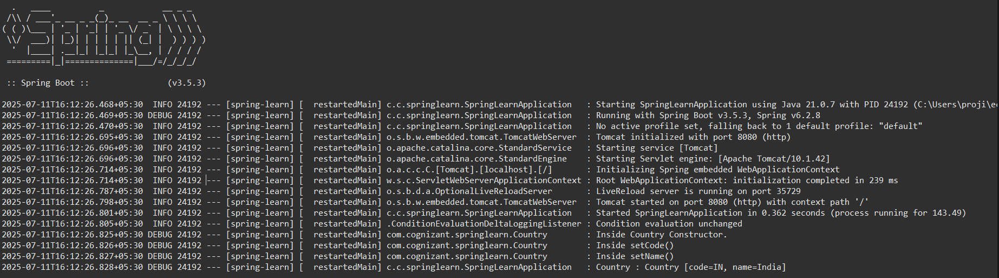

# Spring Core – Load Country from Spring Configuration XML 


## Bean Configuration (`country.xml`)

```xml
<?xml version="1.0" encoding="UTF-8"?>
<beans xmlns="http://www.springframework.org/schema/beans"
       xmlns:xsi="http://www.w3.org/2001/XMLSchema-instance"
       xsi:schemaLocation="
			http://www.springframework.org/schema/beans
			http://www.springframework.org/schema/beans/spring-beans.xsd">

    <bean id="country" class="com.cognizant.springlearn.Country">
        <property name="code" value="IN"/>
        <property name="name" value="India"/>
    </bean>

</beans>

```

### `<bean>` tag
- Declares a Spring bean in the XML configuration.
- Tells the Spring container to manage the lifecycle of the object.

### `id` attribute
- Uniquely identifies the bean within the container.
- Used to retrieve the bean using `context.getBean("id")`.

### `class` attribute
- Specifies the fully qualified class name of the bean to instantiate.
- Spring uses reflection to create an instance of this class.

### `<property>` tag
- Used to inject values into the bean's fields (dependency injection).
- Must match the property names of the class or corresponding setter methods.

### `name` attribute
- Refers to the name of the field or setter in the class (e.g., `setCode`, `setName`).

### `value` attribute
- Assigns a literal value to the specified property (e.g., `"IN"`, `"India"`).

---

## Application Context

```java
ApplicationContext context = new ClassPathXmlApplicationContext("country.xml");
```

- `ApplicationContext` is the Spring container that loads bean definitions and manages their lifecycle.
- It is a more advanced and feature-rich container compared to `BeanFactory`.

### `ClassPathXmlApplicationContext`
- Loads Spring configuration files (like `country.xml`) from the classpath.
- Initializes the application context and instantiates all defined beans.

---

## What exactly happens when context.getBean() is invoked?

```java
Country country = context.getBean("country", Country.class);
```

1. **Bean Lookup**: Spring searches for a bean with ID `"country"` in the context.
2. **Type Casting (Optional)**: `Country.class` ensures type safety when fetching the bean.
3. **Object Return**: Returns the fully initialized and configured instance of the `Country` bean.
4. **Dependency Injection**: Before returning, Spring injects the `code` and `name` properties via their setters.
5. **Logging**: The constructor and setter logs (via SLF4J) confirm bean initialization steps.

---

##  Application Output




