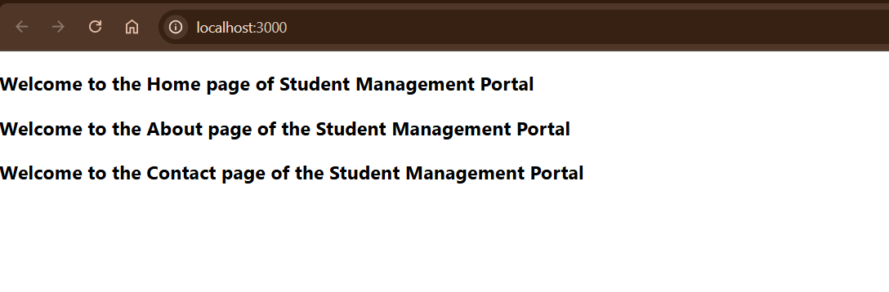

# Objectives

## 1. Explain React Components
React components are the **building blocks** of any React application. A component is a **reusable piece of UI**, which returns JSX (a syntax extension that looks like HTML). Components help in splitting the UI into **independent, reusable parts** that can be handled separately.

---

## 2. Differences between React Components and JavaScript Functions

| Feature              | React Component                        | JavaScript Function                       |
|----------------------|----------------------------------------|--------------------------------------------|
| Purpose              | Build and render UI                    | Perform logic or return values             |
| Return Type          | Returns JSX                            | Returns primitive or object values         |
| Usage in UI          | Rendered in HTML/JSX                   | Used in logic or calculations              |
| Lifecycle Methods    | Available (in class components)        | Not applicable                             |
| State Handling       | Yes (stateful components)              | No built-in state management               |

---

## 3. Types of React Components

1. **Class Components**  
2. **Function Components**

---

## 4. Explain Class Component

A **class component** is a more traditional way to define components in React. It extends from `React.Component` and must have a `render()` method that returns JSX.

```jsx
import React, { Component } from "react";

class Example extends Component {
  render() {
    return <h1>Hello from Class Component!</h1>;
  }
}

export default Example;
````

---

## 5. Explain Function Component

Function components are **simpler and modern**. They are plain JavaScript functions that return JSX. From React 16.8 onward, function components can also manage state and lifecycle using **hooks** (like `useState`, `useEffect`).

```jsx
import React from "react";

function Example() {
  return <h1>Hello from Function Component!</h1>;
}

export default Example;
```

---

## 6. Define Component Constructor

In **class components**, the constructor is used to:

* Initialize the component's **state**
* **Bind** event handlers

The constructor is the first method called in the lifecycle.

```jsx
constructor(props) {
  super(props);
  this.state = { count: 0 };
}
```

---

## 7. Define render() Function

* The `render()` function is **mandatory** in a class component.
* It **returns JSX**, which defines what should appear on the screen.
* It is called **every time the component re-renders** (when state or props change).

```jsx
render() {
  return <h1>This is rendered on the screen</h1>;
}
```

---

## Output

