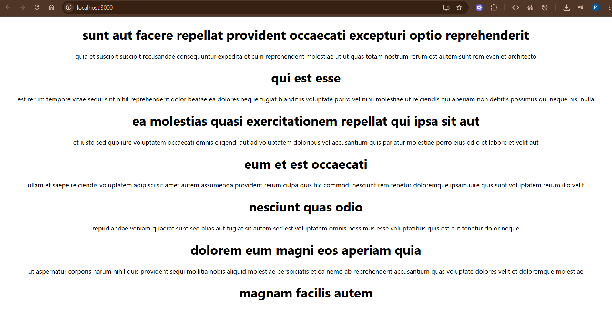

# React Component Lifecycle

## 1. Explain the Need and Benefits of Component Lifecycle

The **React component lifecycle** defines the series of methods that are invoked at different stages of a component's existence:
- **Mounting** (creation)
- **Updating** (re-rendering)
- **Unmounting** (removal)
- **Error handling**

### Benefits:
- Helps developers hook into different stages of the component's life.
- Enables API calls, DOM manipulations, cleanup operations, and error handling.
- Improves **efficiency**, **error tracking**, and **performance optimization**.
- Encourages **structured and maintainable** code.

---

## 2. Identify Various Lifecycle Hook Methods

Lifecycle methods are available only in **class components**. Here’s a categorized list:

### **Mounting (Component is being added to the DOM)**
- `constructor()`
- `static getDerivedStateFromProps()`
- `render()`
- `componentDidMount()`

### **Updating (Component's props/state changes)**
- `static getDerivedStateFromProps()`
- `shouldComponentUpdate()`
- `render()`
- `getSnapshotBeforeUpdate()`
- `componentDidUpdate()`

### **Unmounting (Component is removed from DOM)**
- `componentWillUnmount()`

### **Error Handling**
- `componentDidCatch(error, info)`
- `static getDerivedStateFromError()`

---

## 3. List the sequence of steps in rendering a component 

### **Mounting Phase** (First render):
1. `constructor()`
2. `getDerivedStateFromProps()`
3. `render()`
4. `componentDidMount()`

### **Updating Phase** (Props or state change):
1. `getDerivedStateFromProps()`
2. `shouldComponentUpdate()`
3. `render()`
4. `getSnapshotBeforeUpdate()`
5. `componentDidUpdate()`

### **Unmounting Phase**:
1. `componentWillUnmount()`

---
## Output
