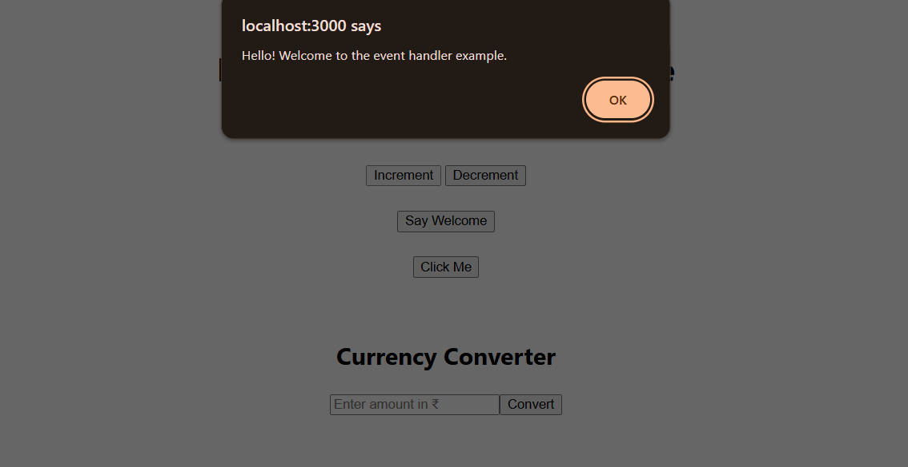

# React Events and Event Handling

## 1. Explain React Events

In React, events are handled similarly to how they are in plain HTML DOM, but with some syntactic and behavioral differences. React wraps the native events inside a cross-browser wrapper known as the **SyntheticEvent** system to ensure compatibility across all browsers.

Examples of events include:
- `onClick` (mouse click)
- `onChange` (input change)
- `onSubmit` (form submission)
- `onKeyDown` (key press)

## 2. Explain about Event Handlers

An **event handler** is a function that is triggered when a specific event occurs on an element. In React, these are usually passed as props to elements.

### Example:

```jsx
function handleClick() {
  alert("Button clicked!");
}

<button onClick={handleClick}>Click Me</button>
````

In the example above, `handleClick` is the event handler for the `onClick` event of the button.

## 3. Define Synthetic Event

A **SyntheticEvent** is a cross-browser wrapper around the native DOM events provided by React. It has the same interface as the browser's native event, including methods like `preventDefault()` and `stopPropagation()`.

React pools `SyntheticEvent` objects for performance. This means the event object is reused and its properties are cleared after the event callback. If you want to access the event asynchronously, you should call `event.persist()`.

### Example:

```jsx
function handleInputChange(e) {
  e.preventDefault();
  console.log("Input changed:", e.target.value);
}
```

## 4. Identify React Event Naming Convention

React follows a **camelCase** naming convention for events instead of the lowercase format used in HTML.

| HTML Event  | React Event |
| ----------- | ----------- |
| onclick     | onClick     |
| onchange    | onChange    |
| onsubmit    | onSubmit    |
| onmouseover | onMouseOver |
| onkeydown   | onKeyDown   |

In addition, event handlers are passed as **function references**, not strings.

### Example (Correct):

```jsx
<button onClick={handleClick}>Click</button>
```

### Example (Incorrect):

```jsx
<!-- This is NOT valid in React -->
<button onclick="handleClick()">Click</button>
```

---
## Output
### Increment & Decrement Counter

### Say Welcome

### Click Me

### Currency Converter
