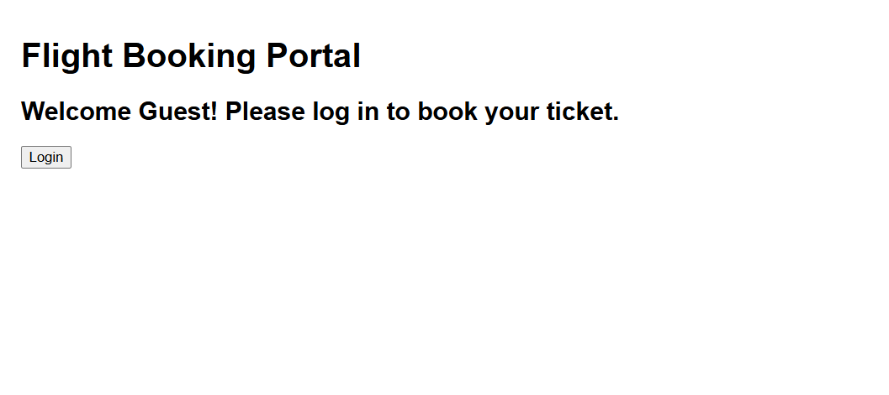

## 1. Conditional Rendering in React

In React, **conditional rendering** refers to the ability to render different UI elements or components based on certain conditions. This is similar to how conditions work in JavaScript using `if`, `else`, `switch`, or ternary operators.

### Example using `if`:

```jsx
function Greeting(props) {
  const isLoggedIn = props.isLoggedIn;
  if (isLoggedIn) {
    return <h1>Welcome back!</h1>;
  }
  return <h1>Please sign up.</h1>;
}
```

### Example using ternary operator:

```jsx
{isLoggedIn ? <LogoutButton /> : <LoginButton />}
```

---

## 2. Element Variables

In React, you can store elements in **variables**, allowing you to dynamically choose what to render.

### Example:

```jsx
let button;
if (isLoggedIn) {
  button = <LogoutButton />;
} else {
  button = <LoginButton />;
}

return (
  <div>
    {button}
  </div>
);
```

This approach helps keep JSX code clean and easier to manage when dealing with multiple rendering conditions.

---

## 3. Prevent Components from Rendering

To prevent a component from rendering, you can:

### **Return `null`** from the component:

If you return `null` from a component's render method or function body, it will not render anything in the UI.

```jsx
function WarningBanner(props) {
  if (!props.warn) {
    return null;
  }
  return <div className="warning">Warning!</div>;
}
```

### **Use short-circuiting (`&&`)**:

Render a component only if a condition is true.

```jsx
{showWarning && <WarningBanner />}
```

This means if `showWarning` is `false`, `WarningBanner` won't render at all.

## Output
### Login Page

### Welcome Page with Logout
