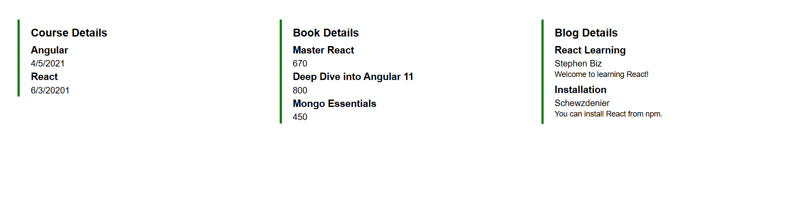

# React: Conditional Rendering, Lists, and Keys

## 1. Various Ways of Conditional Rendering

Conditional rendering in React works the same way conditions work in JavaScript. React provides multiple ways to render content conditionally:

### **Using `if` statements**
```jsx
if (isLoggedIn) {
  return <Dashboard />;
} else {
  return <LoginPage />;
}
````

### **Using Ternary Operator**

```jsx
{isLoggedIn ? <Dashboard /> : <LoginPage />}
```

### **Using Logical AND (`&&`) Operator**

```jsx
{isLoggedIn && <Dashboard />}
```

### **Element Variables**

You can use variables to conditionally store elements.

```jsx
let message;
if (isLoggedIn) {
  message = <Dashboard />;
} else {
  message = <LoginPage />;
}
return <div>{message}</div>;
```

---

## 2. How to Render Multiple Components

You can return multiple components in a React function using:

### **React Fragments**

```jsx
<>
  <Header />
  <Content />
  <Footer />
</>
```

### **Array of Components**

```jsx
return [
  <li key="1">First</li>,
  <li key="2">Second</li>
];
```

---

## 3. Define List Component

A **List Component** in React is used to render multiple similar elements, usually from an array.

```jsx
function NameList() {
  const names = ['Alice', 'Bob', 'Charlie'];
  return (
    <ul>
      {names.map(name => <li key={name}>{name}</li>)}
    </ul>
  );
}
```

---

## 4. Keys in React Applications

**Keys** are unique identifiers used by React to track which items have changed, are added, or are removed. Keys help React optimize rendering performance during reconciliation.

### Example:

```jsx
const items = ['One', 'Two', 'Three'];
const listItems = items.map((item, index) => (
  <li key={index}>{item}</li>
));
```

### Best Practices:

* Use a unique and stable ID if available.
* Avoid using array index as key unless you have no better unique value.

---

## 5. Extract Components with Keys

You can extract a component for each item in a list and pass the key as a prop or directly in JSX.

### Example:

```jsx
function Item({ value }) {
  return <li>{value}</li>;
}

function ItemList() {
  const items = ['Apple', 'Banana', 'Cherry'];
  return (
    <ul>
      {items.map(item => <Item key={item} value={item} />)}
    </ul>
  );
}
```

---

## 6. React Map and `map()` Function

React uses the JavaScript `map()` function to render lists from arrays.

### Example:

```jsx
const fruits = ['Mango', 'Orange', 'Grapes'];

const fruitList = fruits.map((fruit, index) =>
  <li key={index}>{fruit}</li>
);
```

* The `map()` function transforms each item into a React element.
* Always use a **`key`** when rendering elements in a loop.

---

## Output
