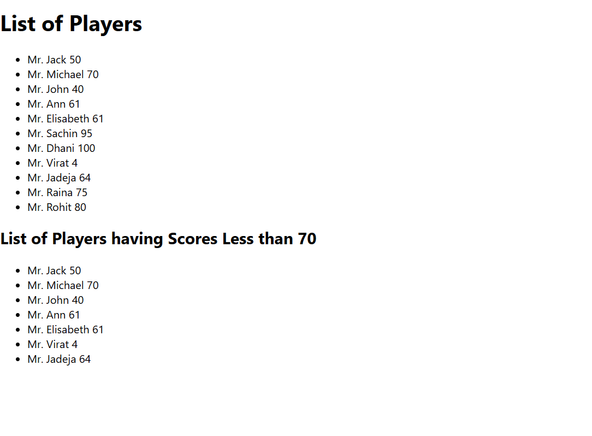

# Week_7 Assignment

## 1. Features of ES6

- **let** and **const** for block-scoped variable declarations
- **Arrow Functions** for concise function expressions
- **Template Literals** for string interpolation
- **Destructuring Assignment** for arrays and objects
- **Default Parameters** in functions
- **Rest and Spread Operators**
- **Classes** and **Inheritance**
- **Modules** (import/export)
- **Promises** for async programming
- **Map** and **Set** collections
- **for...of** loop for iterable objects
- **Enhanced Object Literals**
- **Symbol** type
- **Iterators** and **Generators**

---

## 2. JavaScript `let`

- Declares a block-scoped variable.
- Cannot be redeclared within the same block.
- Can be updated but not redeclared.

```javascript
let x = 5;
x = 10; // allowed
let x = 20; // SyntaxError: Identifier 'x' has already been declared
````

---

## 3. Differences Between `var` and `let`

| Feature       | `var`                               | `let`                           |
| ------------- | ----------------------------------- | ------------------------------- |
| Scope         | Function-scoped                     | Block-scoped (`{}`)             |
| Redeclaration | Allowed                             | Not allowed in same block       |
| Hoisting      | Hoisted, initialized as `undefined` | Hoisted but not initialized     |
| Global Object | Becomes part of `window` object     | Does **not** attach to `window` |

---

## 4. JavaScript `const`

* Declares block-scoped **constant** variables.
* Must be initialized during declaration.
* Cannot be reassigned.
* For objects/arrays, **contents can still be mutated**.

```javascript
const pi = 3.14;
const arr = [1, 2];
arr.push(3); // allowed

pi = 3.1416; // TypeError: Assignment to constant variable
```

---

## 5. ES6 Class Fundamentals

* Introduced to write **object-oriented code** more cleanly.
* Syntax sugar over prototype-based inheritance.

```javascript
class Person {
  constructor(name) {
    this.name = name;
  }

  greet() {
    return `Hello, ${this.name}`;
  }
}
```

---

## 6. ES6 Class Inheritance

* `extends` keyword allows inheritance.
* `super()` is used to call the parent constructor.

```javascript
class Employee extends Person {
  constructor(name, role) {
    super(name); // Calls Person constructor
    this.role = role;
  }

  describe() {
    return `${this.name} is a ${this.role}`;
  }
}
```

---

## 7. ES6 Arrow Functions

* Concise syntax for writing functions.
* Does **not bind its own `this`** (lexical `this`).
* Cannot be used as constructors.

```javascript
const add = (a, b) => a + b;
const greet = name => `Hello, ${name}`;
```

---

## 8. `Set()` and `Map()` in ES6

### `Set`

* Collection of **unique values**.
* No duplicates allowed.

```javascript
const s = new Set([1, 2, 2, 3]);
console.log(s); // Set { 1, 2, 3 }
```

### `Map`

* Stores **key-value** pairs.
* Keys can be of any type (not just strings).

```javascript
const m = new Map();
m.set("name", "Projita");
m.set(123, "RollNo");

console.log(m.get("name")); // Projita
console.log(m.size); // 2
```

---
## Output:-
### Flag = true

### Flag = false
